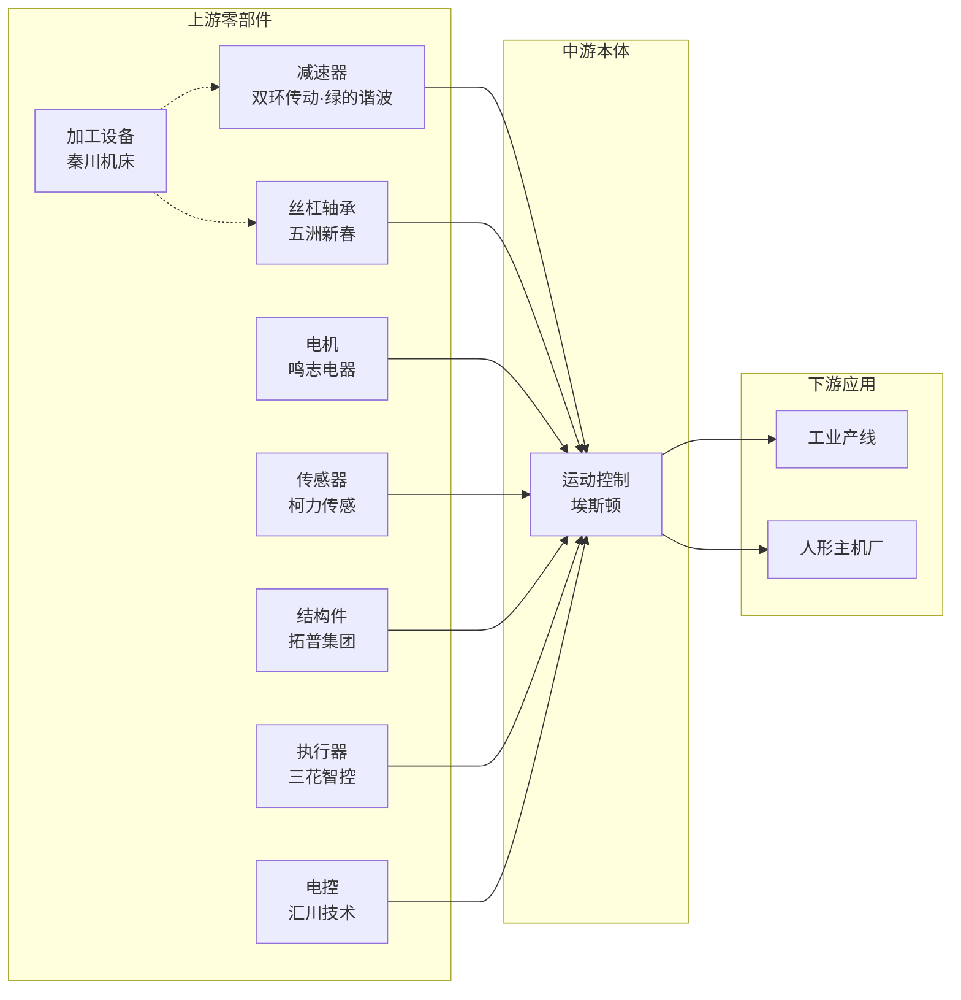

# 人形机器人风口来袭 · 十大选手梳理

> **海报标题**：人形机器人风口来袭，十大选手谁会一飞冲天？  
> **副标题**：人形机器人产业链 · 核心标的梳理（不含股价与代码）  
> **来源参考**：@寻牛老陈「人形机器人梳理」系列  
> **产业链归属**：`机器人` / `物理AI`（具身智能）  
> **关联策略**：一进二弱转强选股逻辑（`clone一进二弱转强_optimized.pyt`）

---

## 海报主视觉文案

```
┌─────────────────────────────────────────┐
│  人形机器人风口来袭                      │
│  十大选手谁会一飞冲天？                  │
├─────────────────────────────────────────┤
│  [按排名展示 10 家核心标的]              │
│  公司名 · 核心标签                       │
├─────────────────────────────────────────┤
│  产业链：零部件 → 本体 → 应用            │
│  策略：情绪主升做一进二 / 分歧做弱转强    │
└─────────────────────────────────────────┘
```

---

## 十大选手一览

| 排名 | 公司 | 核心标签 | 产业链环节 |
|:----:|------|----------|------------|
| 1 | **埃斯顿** | 具身智能 + 人形机器人 | 控制系统 / 本体制造 |
| 2 | **拓普集团** | 人形机器人 + 特斯拉产业链 | 结构件 / 轻量化部件 |
| 3 | **三花智控** | 人形机器人 + 热管理 | 线性执行器 / 机电模组 |
| 4 | **双环传动** | 新能源汽车 + 机器人关节 | 减速器 / 精密传动 |
| 5 | **五洲新春** | 人形机器人 + 汽车热管理 | 丝杠 / 轴承 / 传动件 |
| 6 | **鸣志电器** | 控制电机 + 人形机器人 | 电机与执行部件 |
| 7 | **秦川机床** | 工业母机 + 人形机器人 | 精密加工 / 零部件制造 |
| 8 | **柯力传感** | 传感器 + 人形机器人 | 力觉 / 触觉传感 |
| 9 | **绿的谐波** | 谐波减速器 + 人形机器人 | 旋转关节减速器 |
| 10 | **汇川技术** | 伺服驱动 + 人形机器人 | 关节电控 / 运动控制 |

---

## 逐家详解

### 第 1 位 · 埃斯顿

**标签**：具身智能 + 人形机器人

**产业链位置**

- **中游**：自主运动控制算法 + 工业机器人本体
- **下游**：汽车 / 3C 产线集成，向人形协作本体延伸

**核心逻辑**

1. 国产工业机器人出货量前列，具备「控制 + 本体 + 集成」全栈能力
2. 具身智能方向：运动规划、焊接/搬运/装配场景经验可迁移至人形
3. 与汇川、埃夫特同属「本体制造」赛道，但埃斯顿更偏自主算法

**策略契合**

| 模式 | 适用场景 |
|------|----------|
| 一进二 | 板块情绪主升、昨日涨停 + 今日竞价高开 2%~8% |
| 弱转强 | 炸板后贴近 MA5、竞价放量转强 |
| 趋势股 | 均线多头 + 放量高开（中长线持有） |

---

### 第 2 位 · 拓普集团

**标签**：人形机器人 + 特斯拉产业链

**产业链位置**

- **上游**：铝合金结构件、执行器壳体
- 北美及国内人形主机厂量产配套，轻量化结构件核心供应商

**核心逻辑**

1. 特斯拉产业链龙头，汽车轻量化经验迁移至人形结构件
2. 2026 年公开报道：北美人形机器人主机厂结构件订单，排产至 2027 年
3. 与三花智控同属「主机厂一级供应商」阵营，订单能见度较高

**订单参考**（产业链订单榜）：人形结构件订单约 **32 亿元**（2026 口径）

---

### 第 3 位 · 三花智控

**标签**：人形机器人 + 热管理

**产业链位置**

- **上游**：机电执行器、线性传动模组
- 热管理（汽车）+ 人形关节执行器双主业

**核心逻辑**

1. 线性执行器扩产，北美及国内人形主机厂关节模组主要供货方
2. 汽车热管理龙头，精密流体控制技术可复用于关节冷却/驱动
3. 产业链订单榜排名第一，订单规模约 **38 亿元**

**与拓普对比**

| 维度 | 三花智控 | 拓普集团 |
|------|----------|----------|
| 核心产品 | 线性执行器 / 机电模组 | 结构件 / 壳体 |
| 技术来源 | 流体控制 + 热管理 | 汽车轻量化冲压 |
| 订单规模 | ~38 亿 | ~32 亿 |

---

### 第 4 位 · 双环传动

**标签**：新能源汽车 + 机器人关节

**产业链位置**

- **上游**：RV 减速器、谐波减速器、精密齿轮
- 人形旋转关节核心传动部件

**核心逻辑**

1. 从汽车齿轮箱延伸至机器人精密减速器
2. RV/谐波双产品线，海外主机厂认证推进中
3. 与绿的谐波同属减速器赛道，双环偏 RV + 汽车产业链协同

**订单参考**：精密减速器订单约 **12 亿元**

**策略提示**：减速器赛道情绪弹性大，一进二模式下需关注概念共振（至少命中 2 个热门题材）。

---

### 第 5 位 · 五洲新春

**标签**：人形机器人 + 汽车热管理

**产业链位置**

- **上游**：行星滚柱丝杠、轴承
- 人形线性关节传动配套

**核心逻辑**

1. 轴承起家，向滚柱丝杠延伸，切入人形线性关节
2. 丝杠产线建设推进，对标贝斯特、北特科技
3. 汽车热管理零部件经验，与人形关节散热/传动场景协同

**订单参考**：2025 年营收 **8.52 亿元**（丝杠业务放量中）

---

### 第 6 位 · 鸣志电器

**标签**：控制电机 + 人形机器人

**产业链位置**

- **中游**：空心杯电机、步进电机
- 灵巧手、腕关节微电机核心供应商

**核心逻辑**

1. 空心杯电机国内龙头，人形灵巧手驱动刚需
2. 步进 + 伺服双产品线，覆盖小型关节执行
3. 与江苏雷利、步科股份同属「电机执行」细分

**订单参考**：空心杯电机订单约 **10 亿元**

---

### 第 7 位 · 秦川机床

**标签**：工业母机 + 人形机器人

**产业链位置**

- **上游**：精密机床、滚动功能部件（丝杠、导轨）
- 为人形机器人零部件（丝杠、减速器）提供加工设备

**核心逻辑**

1. 工业母机国家队，精密磨削/加工设备国内领先
2. 人形机器人放量 → 丝杠/减速器扩产 → 机床设备需求传导
3. 股价弹性大，偏「设备+零部件」双重受益

**与其他标的差异**：秦川偏「卖铲子」逻辑，非直接供货主机厂，但产业链位置关键。

---

### 第 8 位 · 柯力传感

**标签**：传感器 + 人形机器人

**产业链位置**

- **上游**：六维力 / 力矩传感器
- 灵巧手力控、关节力反馈感知

**核心逻辑**

1. 力传感器龙头，人形灵巧手抓取、关节力控刚需
2. 与汉威科技（柔性触觉）、奥普特（视觉）构成感知三角
3. 传感器环节国产化率低，替代空间大

**订单参考**：2025 年营收 **7.18 亿元**

---

### 第 9 位 · 绿的谐波

**标签**：谐波减速器 + 人形机器人

**产业链位置**

- **上游**：谐波减速器
- 人形旋转关节核心传动部件

**核心逻辑**

1. 国内谐波减速器龙头，人形旋转关节刚需配套
2. 2026 年新增产线逐步投产，订单能见度较高
3. 与双环传动同属减速器赛道，绿的谐波更偏谐波专精

**订单参考**：谐波减速器订单约 **18 亿元**（2026 口径）

---

### 第 10 位 · 汇川技术

**标签**：伺服驱动 + 人形机器人

**产业链位置**

- **上游 / 中游**：伺服驱动 + 运动控制总成
- 国内人形本体厂关节电控模组批量交付

**核心逻辑**

1. 工控龙头，伺服+PLC 平台型能力
2. 人形机器人关节电控模组主要供货方之一
3. 与埃斯顿形成「零部件供应 vs 本体全栈」的互补格局

**订单参考**：关节电控订单约 **15 亿元**（2026 口径）

---

## 产业链全景图



### 按环节归类

| 产业链环节 | 十大选手 | 补充标的（产业链图谱） |
|------------|----------|------------------------|
| 减速器 | 双环传动、绿的谐波 | 中大力德 |
| 丝杠 / 轴承 | 五洲新春 | 贝斯特、北特科技 |
| 电机执行 | 鸣志电器 | 江苏雷利、步科股份 |
| 传感器 | 柯力传感 | 汉威科技、奥比中光 |
| 结构件 | 拓普集团 | — |
| 执行器模组 | 三花智控 | — |
| 控制系统 / 本体 | 埃斯顿 | 埃夫特 |
| 关节电控 | 汇川技术 | 雷赛智能 |
| 加工设备 | 秦川机床 | 华中数控、科德数控 |

---

## 与一进二弱转强策略的映射

> 详见 `cursorquant/一进二弱转强/STOCK_SELECTION.md`

### 情绪周期 → 模式选择

| 情绪阶段 | 市场特征 | 十大选手操作倾向 |
|----------|----------|------------------|
| **主升 / 修复** | 涨停多、大盘涨 | 优先 **一进二**：昨日涨停 + 竞价高开 2%~8% |
| **分歧 / 冰点** | 炸板多、分化大 | 优先 **弱转强**：炸板转强 + 竞价放量 |
| **退潮** | 涨停少、大盘跌 | 谨慎参与，或切换趋势股模式 |

### 十大选手 × 策略模式适配

| 公司 | 一进二 | 弱转强 | 趋势股 | 说明 |
|------|:------:|:------:|:------:|------|
| 埃斯顿 | ✅ | ✅ | ✅ | 本体龙头，情绪弹性大 |
| 拓普集团 | ✅ | ✅ | ✅ | 订单能见度高，机构偏好 |
| 三花智控 | ✅ | ✅ | ✅ | 订单榜第一，主线题材 |
| 双环传动 | ✅ | ✅ | ○ | 减速器情绪博弈强 |
| 五洲新春 | ✅ | ✅ | ○ | 丝杠放量预期 |
| 鸣志电器 | ✅ | ✅ | ○ | 空心杯细分龙头 |
| 秦川机床 | ○ | ✅ | ○ | 设备股，弹性大但波动高 |
| 柯力传感 | ○ | ✅ | ○ | 传感器细分，题材偏冷门 |
| 绿的谐波 | ✅ | ✅ | ○ | 谐波减速器龙头，订单能见度高 |
| 汇川技术 | ✅ | ✅ | ✅ | 工控龙头，机构持仓稳定 |

图例：✅ 高度适配 · ○ 视行情而定

### 弱转强关键条件（炸板股）

以十大选手中昨日炸板的标的为例，需同时满足：

1. 近 5 日涨停 **1~2 次**，或收盘价贴近 MA5（±3%）
2. 收盘价 > MA10
3. 昨日成交额 **1~50 亿**
4. 竞价涨幅 **-2% ~ 7%**，竞价量 / 昨日成交量 ≥ **4%**
5. 有概念题材，最好命中 `g.concept_pool` 热门概念

---

## 与现有产业链数据的关系

| 数据资产 | 内容 | 与本海报关系 |
|----------|------|--------------|
| `机器人` 产业链 | 上中下游全景图谱 | 十大选手是其中核心标的子集 |
| `物理AI` 产业链 | 12 个细分领域 | 更完整的具身智能供应链 |
| 人形机器人订单榜 Top10 | 按订单规模排名 | 三花、拓普、绿的谐波等；本海报偏「风口选手」视角 |
| 本海报十大选手 | 市场热度 + 产业链位置 | 与订单榜 Top10 互为补充 |

### 排名差异说明

| 视角 | 第 1 名 | 排序逻辑 |
|------|---------|----------|
| **本海报（风口选手）** | 埃斯顿 | 具身智能 + 本体全栈，市场关注度 |
| **订单榜 Top10** | 三花智控 | 2026 年在手/预计订单规模 |
| **产业链图谱** | 按环节分散 | 不排名，按上中下游归类 |

---

## 海报分镜脚本（短视频 / 图文用）

### 封面

> **人形机器人风口来袭**  
> **十大选手谁会一飞冲天？**

### 分镜 1~10（每家 3 秒）

| 镜号 | 画面 | 配音文案 |
|:----:|------|----------|
| 1 | 埃斯顿 · 具身智能+人形机器人 | 第一位，埃斯顿，国产机器人本体龙头，具身智能全栈布局 |
| 2 | 拓普集团 · 人形机器人+特斯拉产业链 | 第二位，拓普集团，特斯拉供应链龙头，人形结构件核心供应商 |
| 3 | 三花智控 · 人形机器人+热管理 | 第三位，三花智控，线性执行器龙头，订单规模行业领先 |
| 4 | 双环传动 · 新能源汽车+机器人关节 | 第四位，双环传动，RV减速器龙头，旋转关节核心传动 |
| 5 | 五洲新春 · 人形机器人+汽车热管理 | 第五位，五洲新春，滚柱丝杠新秀，线性关节传动配套 |
| 6 | 鸣志电器 · 控制电机+人形机器人 | 第六位，鸣志电器，空心杯电机龙头，灵巧手驱动核心 |
| 7 | 秦川机床 · 工业母机+人形机器人 | 第七位，秦川机床，工业母机国家队，零部件加工设备龙头 |
| 8 | 柯力传感 · 传感器+人形机器人 | 第八位，柯力传感，六维力传感器龙头，关节力控感知 |
| 9 | 绿的谐波 · 谐波减速器+人形机器人 | 第九位，绿的谐波，谐波减速器龙头，旋转关节核心部件 |
| 10 | 汇川技术 · 伺服驱动+人形机器人 | 第十位，汇川技术，工控龙头，关节电控与运动控制平台 |

### 结尾

> 人形机器人产业链持续梳理中  
> 关注 @寻牛老陈 · 仅供学习，不构成投资建议

---

## 风险提示

1. **内容性质**：本海报为产业链知识梳理，不含股价与股票代码。
2. **排名主观性**：「十大选手」排序反映市场热度与产业链位置，不等于投资建议或业绩预测。
3. **策略风险**：一进二 / 弱转强为短线打板策略，高波动、高回撤，需严格止损。
4. **订单数据**：订单规模为公开报道口径，存在预测成分，以公司公告为准。

---

## 文件索引

```
hotIndustryChain/
├── humanoid-eight-poster.html          ← 海报页面（可下载/复制）
├── docs/人形机器人-八大选手海报.md     ← 完整梳理文档
├── data/member-zone2026.js             ← 会员专区含人形机器人传感分类
└── order-tracks.html                   ← 人形机器人订单榜 Top10 海报

OMC/data/industry-chain/source/
├── data.js                             ← 机器人 / 物理AI 产业链图谱
└── sector-data.js                      ← 板块龙头数据

cursorquant/一进二弱转强/
├── STOCK_SELECTION.md                  ← 选股逻辑说明
├── OPTIMIZATION.md                     ← 策略优化文档
└── clone一进二弱转强_optimized.pyt     ← 优化版策略
```

---

*海报内容整理自公开短视频素材，并结合产业链图谱与一进二弱转强策略逻辑补充完善。*
